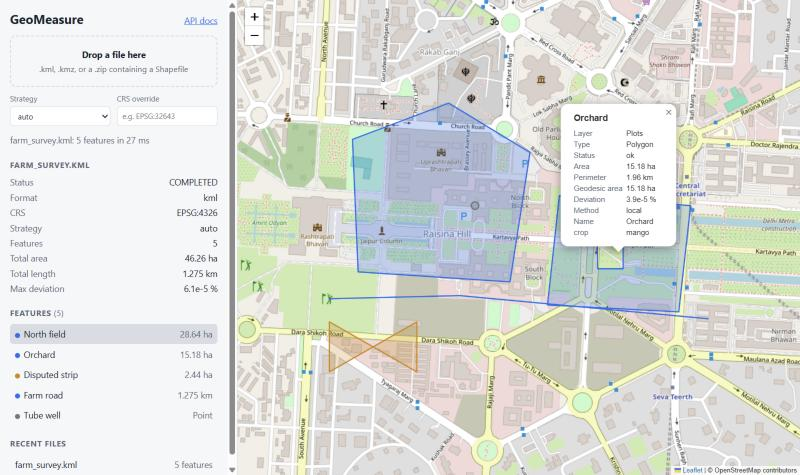
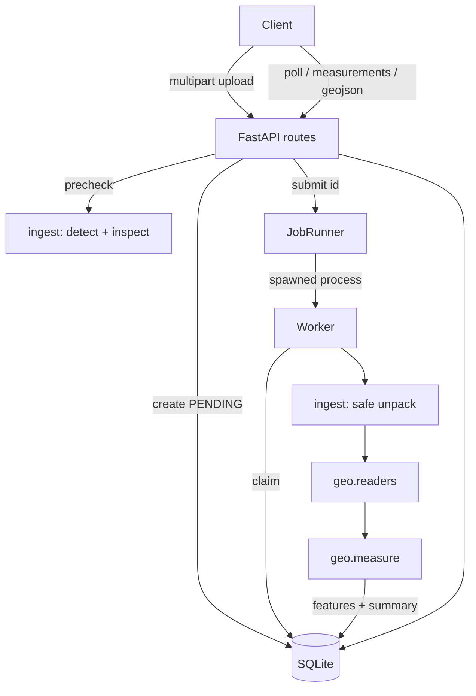
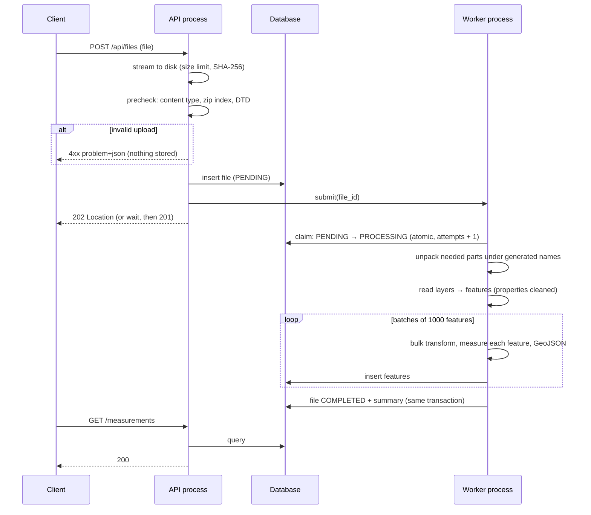
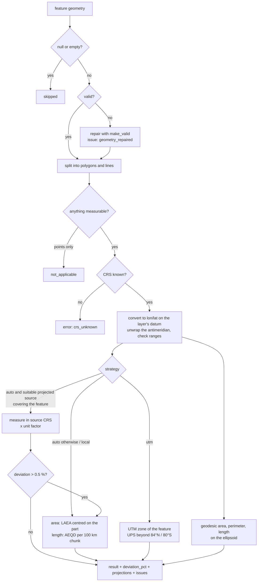

# GeoMeasure: Geospatial File Measurement API

[](https://github.com/Phantom-TA/Aereo/actions/workflows/ci.yml)

A FastAPI service that accepts a **Shapefile** (zipped), **KML** or **KMZ**, extracts every
feature (ID, geometry type, geometry, CRS, properties), and measures it: **area and
perimeter** for polygons, **length** for lines.

It never measures in latitude/longitude degrees. Each feature is measured in a projection
chosen *for that feature and for that quantity*, and every result is **cross-checked against an
independent geodesic calculation on the ellipsoid**, so each measurement reports how
accurate it is.



---

- [Highlights](#highlights)
- [Quick start](#quick-start)
- [API](#api)
- [Architecture](#architecture)
- [CRS handling](#crs-handling)
- [Accuracy](#accuracy)
- [Design decisions](#design-decisions-and-alternatives-considered)
- [Configuration](#configuration)
- [Testing](#testing)
- [Performance](#performance)
- [Assumptions and limitations](#assumptions-and-limitations)
- [Learnings](#learnings)
- [Future scope](#future-scope)

## Highlights

| | |
|---|---|
| **Correct measurement** | Area in a Lambert Azimuthal **equal-area** projection centred on the feature (exact area by construction); lengths in an **equidistant** projection, chunked every 100 km. Files already in a suitable projected CRS (UTM, state plane, national grids) are measured natively, with **feet converted to metres**. |
| **Self-checking** | Every feature also gets a geodesic area/length on the ellipsoid and a `deviation_pct`. A source CRS that disagrees with the geodesic result (e.g. a distorted custom projection) is detected and the feature is **re-measured automatically**. |
| **Proven, not claimed** | Tests check results against closed-form ellipsoid formulas, not against the library being used. A [benchmark](#accuracy) shows the error of each common approach. |
| **Messy real-world files** | Nested folders, several Shapefiles per zip, missing `.prj`/`.shx`/`.dbf`, legacy encodings, uppercase extensions, macOS junk, KML folders, `MultiGeometry`, `gx:Track`, 3D coordinates, self-intersecting polygons (repaired), shapes crossing the antimeridian, polar shapes. |
| **Graceful by design** | Points, empty or null geometries, unknown CRSs and broken shapes get a per-feature `status` and machine-readable `issues`; one bad feature never fails the file. |
| **Secure by construction** | Content-based format detection, size limits enforced while streaming, zip-bomb checks, KML with DTD/entities refused (XXE / billion laughs), and archive paths never touch the disk, so zip-slip cannot happen. |
| **Production plumbing** | Background processing in **crash-isolated worker processes**, job state in the database (survives restarts), poison-pill protection, RFC 9457 errors, request IDs, JSON logs, Docker, CI. |
| **Easy to review** | A map viewer at `/`, interactive docs at `/docs`, sample files in [`samples/`](samples), a CLI, and 174 tests at 97 % coverage. |

## Quick start

### Docker

```bash
docker compose up --build
```

Open <http://localhost:8000> for the map viewer and <http://localhost:8000/docs> for the API docs.

### Local (Python 3.11+)

```bash
python -m venv .venv
source .venv/bin/activate          # Windows: .venv\Scripts\activate
pip install -e ".[dev]"
uvicorn app.main:app --reload
```

GDAL, GEOS and PROJ ship inside the `pyogrio`, `shapely` and `pyproj` wheels: there is nothing
else to install, on Linux, macOS or Windows.

### Try it

```bash
# upload and wait up to 10 s for the result
curl -H "Prefer: wait=10" -F "file=@samples/farm_survey.kml" http://localhost:8000/api/files/

# then, with the returned id
curl http://localhost:8000/api/files/<id>/measurements/
```

Or measure a file without running the server, through the same pipeline:

```bash
geomeasure measure samples/parcels_utm43n.zip
geomeasure measure samples/parcels_no_prj.zip --crs EPSG:32643 --json
```

| Sample | What it shows |
|---|---|
| `farm_survey.kml` | Fields (one with a pond hole), a self-intersecting polygon that gets repaired, a road, a well |
| `parcels_utm43n.zip` | 12 parcels in UTM 43N, measured natively in the file's CRS |
| `parcels_no_prj.zip` | The same parcels without a `.prj`: `crs_unknown` until `?crs=EPSG:32643` is passed |
| `pipeline_ny_feet.zip` | A line in NY State Plane, **US survey feet**, converted to metres |
| `fields_web_mercator.zip` | A field in Web Mercator: detected as unsuitable, reprojected, and gives the same area as the KML |
| `fiji_antimeridian.kml` | A parcel crossing 180°: 1.18 km², not a polygon wrapped around the planet |

## API

| Method | Path | Purpose |
|---|---|---|
| `POST` | `/api/files/` | Upload and process a file |
| `GET` | `/api/files/{id}/` | File information and processing status |
| `GET` | `/api/files/{id}/measurements/` | Per-feature measurements (filterable, paginated) |
| `GET` | `/api/files/{id}/features/` | Features with geometry, CRS, properties and measurement |
| `GET` | `/api/files/{id}/geojson` | Everything as a GeoJSON FeatureCollection (WGS84) |
| `POST` | `/api/files/{id}/reprocess` | Re-measure with another strategy, without re-uploading |
| `DELETE` | `/api/files/{id}/` | Delete a file, its features and the stored upload |
| `GET` | `/api/files/` | List files (`?status=`, `?limit=`, `?offset=`) |
| `GET` | `/health` | Liveness and database status |

Trailing slashes are optional on every path. Full schemas, with examples, are at `/docs`.

### Upload: `POST /api/files/`

Multipart field `file`: a `.kml`, a `.kmz`, or a `.zip` containing one or more Shapefiles.

| Query parameter | Meaning |
|---|---|
| `crs` | CRS to use when the file has none, or to override it (`EPSG:32643`, WKT, PROJ string) |
| `strategy` | `auto` (default), `local` or `utm`: see [CRS handling](#crs-handling) |

The file is validated immediately and processed in the background. The response is
**`202 Accepted`** with a `Location` header; poll the file until `status` is `COMPLETED`.
To get the result in one round trip, send the standard header `Prefer: wait=10`: if processing
finishes within that time the response is **`201 Created`** with the finished file.

```http
POST /api/files/ HTTP/1.1
Prefer: wait=10
Content-Type: multipart/form-data; boundary=...
```

```http
HTTP/1.1 201 Created
Location: /api/files/1b7e6b3280644919b24cf08dc401a32f
Preference-Applied: wait=10
```

```json
{
  "id": "1b7e6b3280644919b24cf08dc401a32f",
  "filename": "farm_survey.kml",
  "status": "COMPLETED",
  "format": "kml",
  "feature_count": 5,
  "crs": "EPSG:4326",
  "strategy": "auto",
  "crs_override": null,
  "size_bytes": 1611,
  "sha256": "a3bbd62417a216007664784560c81006b1ed65fdad661b1ef0acc88d6e93291f",
  "bbox": [77.2, 28.61, 77.213, 28.6181],
  "layers": [
    {"name": "Plots", "crs": "EPSG:4326", "crs_source": "file", "feature_count": 3, "issues": []},
    {"name": "Infrastructure", "crs": "EPSG:4326", "crs_source": "file", "feature_count": 2, "issues": []}
  ],
  "summary": {
    "geometry_types": {"Polygon": 3, "LineString": 1, "Point": 1},
    "measurement_status": {"ok": 4, "not_applicable": 1},
    "total_area_m2": 462550.698,
    "total_perimeter_m": 5023.289,
    "total_length_m": 1275.159,
    "total_geodesic_area_m2": 462550.694,
    "total_geodesic_length_m": 1275.158,
    "max_deviation_pct": 6.1e-05,
    "features_with_issues": 2
  },
  "issues": [],
  "error": null,
  "attempts": 1,
  "created_at": "2026-10-09T10:00:45.750655Z",
  "started_at": "2026-10-09T10:00:45.760335Z",
  "completed_at": "2026-10-09T10:00:45.868310Z",
  "processing_ms": 99,
  "links": {
    "self": "/api/files/1b7e6b3280644919b24cf08dc401a32f",
    "measurements": "/api/files/1b7e6b3280644919b24cf08dc401a32f/measurements",
    "features": "/api/files/1b7e6b3280644919b24cf08dc401a32f/features",
    "geojson": "/api/files/1b7e6b3280644919b24cf08dc401a32f/geojson"
  }
}
```

`GET /api/files/{id}/` returns the same document at any point in its life (`PENDING` →
`PROCESSING` → `COMPLETED` / `FAILED`). A failed file carries `error: {code, message}`.

### Measurements: `GET /api/files/{id}/measurements/`

Filters: `geometry_type`, `status`, `layer`, `has_issues`; pagination: `limit` (≤ 1000),
`offset`. Values are in metres and square metres.

```json
{
  "file_id": "1b7e6b3280644919b24cf08dc401a32f",
  "total": 5,
  "limit": 100,
  "offset": 0,
  "summary": { "...": "same as on the file" },
  "items": [
    {
      "index": 0,
      "source_id": null,
      "layer": "Plots",
      "geometry_type": "Polygon",
      "crs": "EPSG:4326",
      "status": "ok",
      "area_m2": 286361.766,
      "perimeter_m": 2056.343,
      "length_m": null,
      "geodesic": {"area_m2": 286361.761, "perimeter_m": 2056.342, "length_m": null},
      "deviation_pct": 3.83e-05,
      "method": "local",
      "projections": ["LAEA(lat_0=28.5, lon_0=77.25)", "AEQD(lat_0=28.5, lon_0=77.25)"],
      "issues": []
    },
    {
      "index": 2,
      "layer": "Plots",
      "geometry_type": "Polygon",
      "status": "ok",
      "area_m2": 24388.43,
      "method": "local",
      "issues": [
        {"code": "geometry_repaired", "message": "Invalid geometry repaired (Self-intersection[77.2015 28.61075])."}
      ]
    },
    {
      "index": 4,
      "layer": "Infrastructure",
      "geometry_type": "Point",
      "status": "not_applicable",
      "area_m2": null,
      "length_m": null,
      "issues": [{"code": "not_measurable", "message": "Point has no area or length."}]
    }
  ]
}
```

(Items abbreviated.) `status` is one of `ok`, `not_applicable` (points), `skipped` (no or empty
geometry) and `error` (e.g. unknown CRS). `method` says how the number was produced: `source`
(in the file's own CRS), `local` (feature-centred projections) or `utm`.

### Features: `GET /api/files/{id}/features/`

Same filters and pagination. Each item has `index`, `source_id` (Shapefile FID or KML `id`),
`layer`, `geometry_type`, `crs`, `has_z`, a GeoJSON `geometry`, the original `properties`, and
its `measurement`. Geometry is returned in the **source CRS** by default, or in WGS84 with
`?geometry_crs=wgs84`.

```json
{
  "index": 0,
  "source_id": null,
  "layer": "Plots",
  "geometry_type": "Polygon",
  "crs": "EPSG:4326",
  "has_z": true,
  "geometry": {"type": "Polygon", "coordinates": [[[77.201, 28.613, 0.0], [77.2062, 28.6127, 0.0], "..."]]},
  "properties": {"Name": "North field", "crop": "wheat"},
  "measurement": { "...": "as in /measurements" }
}
```

### GeoJSON export: `GET /api/files/{id}/geojson`

An RFC 7946 `FeatureCollection` in WGS84, streamed. Each feature keeps its original attributes
and gains `_area_m2`, `_length_m`, `_deviation_pct`, `_status`, `_issues` and more, so it can be
dropped straight into QGIS or [geojson.io](https://geojson.io).

### Errors

Every error is an [RFC 9457](https://www.rfc-editor.org/rfc/rfc9457) problem document with a
stable `code`:

```json
{
  "type": "about:blank",
  "title": "Unsupported Media Type",
  "status": 415,
  "code": "unsupported_format",
  "detail": "Unsupported file (.geojson). Upload a .kml, a .kmz, or a .zip containing a Shapefile."
}
```

| Status | Codes |
|---|---|
| 400 | `empty_file` |
| 404 | `file_not_found`, `not_found` |
| 409 | `file_not_ready`, `file_failed`, `file_busy` |
| 413 | `file_too_large`, `archive_too_large` |
| 415 | `unsupported_format`, `xml_dtd_not_allowed` |
| 422 | `invalid_archive`, `no_supported_data`, `archive_too_many_entries`, `archive_suspicious_compression`, `archive_encrypted`, `invalid_crs`, `validation_error` |

Problems found *while processing* do not produce HTTP errors; they are reported on the
file, layer or feature they concern:

| Level | Issue codes |
|---|---|
| File | `no_features`, `ignored_entries`, `nested_archive_ignored`, `incomplete_shapefile`, `unreadable_layer`; or, if nothing is readable, `FAILED` with `no_readable_layers` / `unreadable_kml` |
| Layer | `crs_assumed`, `crs_unknown`, `crs_overridden`, `crs_unparseable`, `crs_unusable`, `missing_shx`, `missing_dbf` |
| Feature | `geometry_repaired`, `antimeridian_normalized`, `source_crs_unsuitable`, `outside_crs_area_of_use`, `source_crs_fallback`, `high_deviation`, `not_measurable`, `no_geometry`, `empty_geometry`, `non_finite_coordinates`, `invalid_coordinates`, `unsupported_geometry`, `crs_unknown`, `projection_failed` |

## Architecture

### Application structure

```
app/
├── main.py              app factory, lifespan (DB init, workers, crash recovery), viewer
├── cli.py               `geomeasure measure FILE`, same pipeline without the API
├── api/                 HTTP layer only
│   ├── routes.py        endpoints
│   ├── schemas.py       response models (and OpenAPI docs)
│   ├── errors.py        RFC 9457 problem responses
│   └── middleware.py    request IDs, streaming body-size limit, optional trailing slash
├── ingest/              turning an untrusted upload into files GDAL can read
│   ├── detect.py        format by content (zip magic / KML root), DTD refusal
│   ├── archive.py       zip inspection: bombs, limits, junk, grouping Shapefile parts
│   ├── prepare.py       safe extraction + reading layers
│   └── upload.py        streaming save with size limit and SHA-256
├── geo/                 the measurement core: pure Python, no web or DB code
│   ├── readers.py       Shapefile / KML → Feature objects (pyogrio)
│   ├── crs.py           CRS resolution and classification, projection selection
│   ├── geometry.py      repair, antimeridian unwrapping, geodesic densification
│   ├── measure.py       projected + geodesic measurement per feature
│   └── types.py         domain types
├── services/processing.py   one job: unpack → read → measure → store (batched)
├── jobs/runner.py       background execution in worker processes
├── db/                  SQLAlchemy models, repository, session
└── static/              the map viewer (HTML + JS + CSS, no build step)
```

`geo/` does not import FastAPI, SQLAlchemy or anything from `api/`. It can be tested and reused on
its own; the CLI is an example.



### File-processing flow



1. **Upload.** The body is streamed to `data/uploads/<id>/upload.bin` with the size limit
   enforced as bytes arrive (an ASGI middleware rejects oversized requests before they are
   buffered). The client's filename is only display metadata.
2. **Precheck (synchronous, cheap).** The format is decided by **content**: a zip signature or a
   KML root element. For zips only the central directory is read, checking entry count,
   declared uncompressed size, compression ratio and encryption. Bad uploads get an immediate 4xx
   and nothing is stored.
3. **Queue.** A `PENDING` row is written and the id is handed to the job runner.
4. **Claim.** A worker atomically moves the row to `PROCESSING` and increments `attempts`;
   if the job was already taken, or has crashed `max_attempts` times, it stops.
5. **Unpack.** Only the parts GDAL needs (`.shp .shx .dbf .prj .cpg`, or the main `.kml` of a
   KMZ) are extracted, under names *we* generate (`layer0.shp`), with a byte budget counting
   real decompressed bytes. Paths from the archive are never used on disk.
6. **Read.** Each Shapefile and each KML folder becomes a layer. CRS is resolved per layer.
   KML's boilerplate fields (`tessellate`, `drawOrder`, …) are dropped.
7. **Measure and store.** Features are processed in batches of 1000: coordinates are transformed
   and GeoJSON is built in one native call per batch, then each feature is measured. Batches are
   inserted as they are produced, and the file is marked `COMPLETED` in the same transaction, so
   a crash never leaves a half-written file looking finished.

### Measurement calculation flow



- **Polygons** get area and perimeter (outer *and* inner rings, as shapely and QGIS do).
  **Lines** get length. Multi-geometries are summed part by part; a `GeometryCollection` (for
  example KML `MultiGeometry`) gets both.
- **Every part of a multi-part feature gets its own projection**, so a MultiPolygon with parts on
  two continents is still measured exactly.
- **Long edges are densified along the geodesic** (one point every ≤ 10 km), so projected and
  geodesic results describe the same shape.
- **3D coordinates** are kept in the stored geometry, but measurements are planimetric
  (horizontal), which is what area and length mean for parcels and routes.

## CRS handling

**Resolving the CRS of each layer**

| Situation | Result |
|---|---|
| `?crs=` given | Used (`crs_source: override`); if the file declared a different CRS, the issue `crs_overridden` |
| `.prj` / KML present | Used (`crs_source: file`); KML is always WGS84 per the KML spec |
| No CRS, coordinates fit lon/lat ranges | Assumed EPSG:4326 (`crs_assumed`) |
| No CRS, projected-looking coordinates | `crs_unknown`: features report `status: error` and the message tells the client to pass `?crs=` |

**Choosing how to measure (`strategy=auto`, the default)**

1. **Geographic CRS (lon/lat)**: measure in projections centred on each feature part:
   - **Area** in a *Lambert Azimuthal Equal-Area* projection (equal-area means the area is
     exact by construction, at any distance from the centre).
   - **Length and perimeter** in an *Azimuthal Equidistant* projection, recentred every 100 km
     along the line so no vertex is far from its centre (the distortion grows with distance²).
2. **Projected CRS** (UTM, state plane, national grids): measure **in the file's own CRS**,
   converting its linear unit to metres (US survey feet, international feet, …). This respects
   the data producer's choice and matches what desktop GIS shows. Two exceptions:
   - CRSs that are unsuitable for measurement (Web Mercator and other Mercator variants,
     Plate Carrée, Miller) are recognised and reprojected (`source_crs_unsuitable`).
   - A feature outside the CRS's published area of use (e.g. a UTM zone used far from home) is
     reprojected (`outside_crs_area_of_use`).
3. **Safety net:** if a native measurement differs from the geodesic one by more than 0.5 % (for
   example a custom projection with a wrong scale factor, which has no published area of use to
   check), the feature is re-measured locally (`source_crs_fallback`).

`strategy=local` always uses the feature-centred projections; `strategy=utm` uses the UTM zone of
the feature (with the Norway and Svalbard exceptions) or UPS near the poles, which is useful when
results must be stated in a standard EPSG system.

**Details handled along the way**

- **Datums:** coordinates are converted to lon/lat *on the layer's own datum* (NAD27, ETRS89, …)
  and the geodesic check uses that datum's ellipsoid, so no datum shift is introduced into
  measurements. GeoJSON output is transformed to WGS84 as RFC 7946 requires.
- **Axis order:** all transformations use `always_xy`, so EPSG:4326's official lat/lon axis order
  can never swap coordinates.
- **Antimeridian:** rings crossing ±180° are unwrapped (179.9 → 180.1) before measuring; holes
  are kept next to their exterior.
- **Poles:** the local projections work at the poles; the UTM strategy switches to UPS.
- **Out-of-range coordinates** (latitude beyond ±90°) mean the CRS is wrong; the feature
  reports `invalid_coordinates` instead of a nonsense number.
- **Projection centres** are snapped to a 0.25° grid so neighbouring features share cached
  transformers. This costs nothing in area (equal-area projections are exact anywhere) and about
  10⁻⁶ in length.

## Accuracy

Reproduce with `python scripts/accuracy_benchmark.py`. The reference is the **exact**
ellipsoidal area of a 0.01° × 0.01° cell (a closed-form formula, not a library call):

| Latitude | Degrees × 111.32 km | Web Mercator (EPSG:3857) | UTM zone | This API (`auto`) |
|---:|---:|---:|---:|---:|
| 0° | +0.675 % | +0.674 % | −0.049 % | −1.3 × 10⁻⁷ % |
| 30° | +15.9 % | +33.8 % | −0.057 % | −2.7 × 10⁻⁷ % |
| 45° | +41.4 % | **+100 %** | −0.065 % | −4.1 × 10⁻⁷ % |
| 60° | +99.4 % | **+299 %** | −0.072 % | −5.5 × 10⁻⁷ % |
| 75° | +284 % | +1385 % | −0.029 % | −6.6 × 10⁻⁷ % |
| 85° | +1041 % | +13004 % | −0.82 % (UPS) | −6.9 × 10⁻⁷ % |

A 2,200 km line, mostly far from its own centre, agrees with the geodesic length to
7.5 × 10⁻⁶ %.

Notes:
- "Just reproject to EPSG:3857" is the most common shortcut and the worst one: it doubles areas
  at 45° latitude.
- UTM is good, but has a built-in ±0.04–0.1 % scale error. That is why `parcels_utm43n.zip` shows
  `deviation_pct ≈ 0.03`: those parcels lie 214 km from their zone's central meridian, so their
  grid area really is 0.03 % larger than their ground area. The API measures them in the file's
  own CRS, as surveyors expect, and the deviation makes the difference visible instead of hiding
  it.

## Design decisions and alternatives considered

**FastAPI rather than Django + DRF.** The service is a small, typed JSON API with file upload and
background work; FastAPI gives request validation and OpenAPI docs straight from type hints.
Django's ORM, admin and auth would mostly go unused.

**pyogrio + shapely 2 + pyproj, without geopandas.** pyogrio reads Shapefile and KML (with
LIBKML) through a GDAL that ships inside its wheel, so `pip install` works everywhere.
Alternatives: *geopandas* (convenient, but pulls in pandas and hides per-feature control behind
dataframes), *fiona* (slower, per-feature Python objects), *fastkml* (KML only, so two code paths).

**Measure in projections chosen per feature, not one projection per file.**
- *Web Mercator*: rejected, see the benchmark above.
- *One UTM zone for the whole file*: breaks for data spanning zones, at the poles and across the
  antimeridian, and still carries UTM's scale error. Offered as `strategy=utm`.
- *Geodesic only*: the most accurate, but the brief asks for a projected measurement, and having
  both gives the self-check for free.

  Equal-area for area and equidistant for length, because no projection preserves both.

**Report a geodesic value and the deviation for every feature.** It costs one call per feature and
turns "trust me" into a number. It also drives the automatic fallback for bad source CRSs.

**Background processing in a process pool.** Parsing untrusted files runs native code (GDAL).
In worker processes, a crash kills one worker, not the API; the runner rebuilds the pool and
retries, and `claim()` gives up after `max_attempts`, so a poison file ends `FAILED` instead of
looping. A test reproduces this with a real crash (`os._exit`).
- *FastAPI `BackgroundTasks` or threads*: no crash isolation, and they compete with request
  handling for the GIL. Threads remain available (`GEO_WORKER_MODE=thread`).
- *Celery + Redis*: the right tool across many machines, but two extra services for one. The
  runner keeps job state in the database, so it can be replaced without changing the API.

**Job state in the database, not in memory.** Unfinished jobs are resubmitted on startup, which
makes restarts and crashes safe.

**`202 Accepted` plus `Prefer: wait`.** Asynchronous by default (large files cannot block a
request), but clients can opt into one round trip with a standard HTTP header (RFC 7240) instead
of a custom flag.

**Validate synchronously, process asynchronously.** Format, zip-bomb and DTD checks are cheap
(at most 64 KB and the zip index), so they return a proper 4xx while the client waits. Only real
parsing is deferred.

**Unpack only what is needed, under generated names.** Reading straight from the zip through
GDAL's `/vsizip/` was tried first; it cannot rebuild a missing `.shx` and fails on mixed-case
extensions. Copying the five possible sidecar files to `layer0.shp` and so on fixes both, and since no
archive path is ever used on disk, zip-slip is impossible rather than merely checked for.

**SQLite, with geometry stored as GeoJSON text.** No setup for reviewers; WAL mode lets the API read
while a worker writes. GeoJSON is generated in bulk by GEOS and streamed out by the export
without being parsed again. Any SQLAlchemy URL works (`GEO_DATABASE_URL`); PostGIS is the
natural next step (see future scope).

**A stable `code` on every error and issue.** Messages are for people, codes are for programs:
clients can branch on `crs_unknown` without parsing English.

## Configuration

All settings are environment variables with the `GEO_` prefix (see [`.env.example`](.env.example)).

| Variable | Default | |
|---|---|---|
| `GEO_DATA_DIR` | `data` | Uploads, SQLite database and scratch space |
| `GEO_DATABASE_URL` | SQLite in `GEO_DATA_DIR` | Any SQLAlchemy URL |
| `GEO_MAX_UPLOAD_BYTES` | 100 MB | Upload size limit |
| `GEO_MAX_UNCOMPRESSED_BYTES` | 1 GB | Limit on what an archive may expand to |
| `GEO_MAX_ZIP_ENTRIES` | 1000 | Files per archive |
| `GEO_MAX_COMPRESSION_RATIO` | 200 | Per-entry ratio above which an archive is treated as a zip bomb |
| `GEO_WORKER_MODE` | `process` | `process` (crash-isolated) or `thread` |
| `GEO_WORKERS` | 2 | Concurrent jobs |
| `GEO_MAX_ATTEMPTS` | 3 | Crashes tolerated per file |
| `GEO_MAX_WAIT_SECONDS` | 30 | Cap for `Prefer: wait=N` |
| `GEO_DEFAULT_STRATEGY` | `auto` | Measurement strategy when none is requested |
| `GEO_GEODESIC_WARN_PCT` | 0.5 | Deviation that triggers `high_deviation` / fallback |
| `GEO_LOG_FORMAT` | `text` | `json` in Docker |

## Testing

```bash
pytest                      # 174 tests
pytest --cov=app            # 97 % coverage
ruff check . && mypy app    # lint + strict type checking
```

| Suite | What it covers |
|---|---|
| `tests/geo` | Measurements against closed-form ellipsoid formulas at many latitudes, holes, multi-parts, antimeridian, poles, UTM/UPS, Web Mercator, feet, area-of-use, fallback, repair, the CRS rules, the readers |
| `tests/ingest` | Hostile and messy archives: zip bomb, encrypted entries, path traversal, too many entries, lying sizes, DTD/XXE, nested folders, junk files, missing sidecars, legacy encodings, KMZ |
| `tests/api` | Every endpoint, filters, pagination, errors, `Prefer: wait`, reprocessing, deletion, **crash recovery on restart**, **a worker killed three times by a poison file**, parallel uploads in thread and process mode, request IDs |
| `tests/test_samples_and_cli.py` | The committed sample files produce what this README says, and the CLI |

CI runs lint, strict type checks and the tests on Linux (Python 3.11, 3.12) and Windows, then
builds the Docker image and uploads a sample to it.

## Performance

Measured on a laptop (Windows, Python 3.12, one worker):

| Input | Time |
|---|---|
| Survey KML with 5 features (`samples/farm_survey.kml`) | ~30–100 ms |
| KML with 300 polygons, lines and points | 0.2–0.3 s |
| 50,000 parcels, UTM Shapefile (measured natively) | 19 s (0.38 ms/feature) |
| 50,000 parcels, WGS84 Shapefile (local projections) | 25 s (0.50 ms/feature) |

What made the difference: building PROJ pipelines directly instead of `Transformer.from_crs`
(13 ms → 0.3 ms per projection, then cached), which took a worst-case benchmark of 10,000 features
spread over the whole globe from more than 5 minutes to 13 s; transforming and serialising a whole
batch per native call instead of per feature; and skipping densification for features too small
to need it. Several files are processed in parallel (`GEO_WORKERS`).

## Assumptions and limitations

- Measurements are planimetric: heights in 3D data are kept but not used.
- Polygon edges are taken to be geodesics (long edges are densified accordingly). For huge
  polygons drawn as straight lines in some specific projection, the area can legitimately differ
  by the shape of those edges.
- A shape spanning more than 180° of longitude is assumed to cross the antimeridian.
- `NetworkLink`s in KML are not followed (a server should not fetch URLs taken from uploads).
- Formats are limited to the brief: Shapefile (zipped), KML, KMZ.
- Designed for a single API instance: crash recovery assumes no other instance is processing
  the same database.

## Learnings

- **Measuring is mostly about CRSs.** The obvious approach, reprojecting to Web Mercator and
  calling `.area`, is badly wrong away from the equator, as the benchmark shows. Choosing a
  projection per quantity (equal-area for area, equidistant for distance) is the idea that made
  everything else simple.
- **Independent checks find real bugs.** Comparing every projected value with a geodesic one
  exposed two problems that ordinary unit tests had missed: pyproj's polygon perimeter leaves out
  the holes while shapely's includes them, and a single equidistant projection drifts by 0.1 % on
  the perimeter of a 1,000 km polygon (fixed by measuring lengths in 100 km chunks).
- **Test against the truth, not against the library.** Closed-form ellipsoid formulas and
  textbook constants (one degree of equator = 111,319.49 m) make the tests independent of the
  code they test.
- **Real files are messy in predictable ways.** Missing `.prj` files, feet, Web Mercator exports,
  self-intersecting hand-drawn polygons and macOS junk in zips are the normal case.
- **Native code changes the architecture.** Once GDAL parses untrusted input, crash isolation
  (processes, not threads) and durable job state stop being nice-to-haves.
- **Profile before optimising.** The slow part was not the geometry maths but building PROJ
  transformers and per-feature Python overhead.

## Future scope

- **PostGIS** for storage, with spatial queries ("features in this bounding box", "total area by
  attribute") and geometry indexes.
- **A real job queue** (Celery/RQ/Arq with Redis) for multiple API instances, plus per-job
  timeouts and cancellation.
- **Splitting a single very large file** across several workers.
- **More formats**: GeoJSON, GeoPackage, GPX, CSV with WKT; reading Shapefiles with curves or Z/M.
- **Surface (3D) area and slope length** from KML altitudes or a DEM, useful for drone surveys of
  uneven terrain.
- **Per-feature choice of reference**: an option to return areas exactly as a national grid or
  cadastral standard defines them.
- **Authentication, quotas and retention policies** for multi-tenant use.
- **Upload to object storage** (S3) with pre-signed URLs for very large files.
